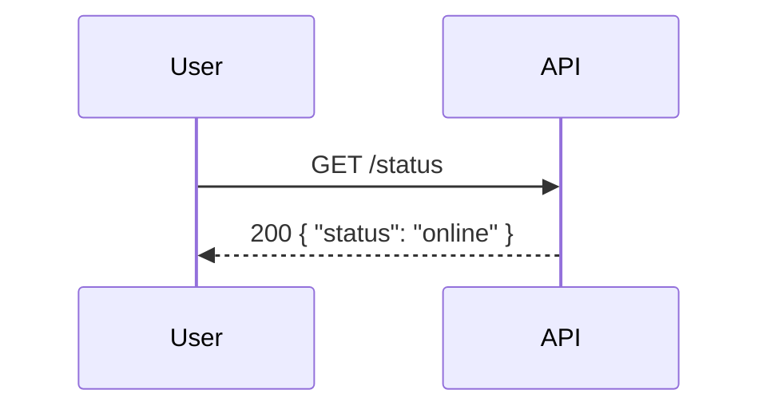

# Comprehensive Refactor Implementation Plan

> **For Claude:** REQUIRED SUB-SKILL: Use superpowers:executing-plans to implement this plan task-by-task.

**Goal:** Transform the monolithic Mermaid-to-OpenAPI converter into a production-ready, comprehensively tested tool with modular architecture, paranoid-level test coverage, robust validation, complete OpenAPI 3.0 feature support, and comprehensive edge case handling.

**Architecture:** Extract monolithic App.tsx into focused modules (parser, generators, validators, types, components, utils) while maintaining the same overall application structure and functionality. Two-stage validation (Mermaid syntax + OpenAPI compliance) with helpful error reporting.

**Tech Stack:** React 19, TypeScript 5.9, Vite 7, Vitest (testing), fast-check (property-based), Stryker (mutation testing), ESLint, Tailwind CSS

---

## Phase 1: Foundation - Testing Infrastructure

### Task 1: Install Testing Dependencies

**Files:**
- Modify: `package.json`

**Step 1: Install required packages**

Run:
```bash
npm install --save-dev vitest @vitest/ui @vitest/coverage-v8 fast-check stryker stryker-jest-runner @testing-library/react @testing-library/jest-dom jsdom
```

Expected: Packages added to `devDependencies` in package.json

**Step 2: Update package.json scripts**

Add to `scripts` section in `package.json`:
```json
{
  "test": "vitest",
  "test:ui": "vitest --ui",
  "test:unit": "vitest run tests/unit",
  "test:coverage": "vitest run --coverage",
  "test:property": "vitest run tests/property",
  "test:fuzz": "vitest run tests/fuzz",
  "test:mutation": "stryker run",
  "test:all": "npm run test:unit && npm run test:property && npm run test:fuzz",
  "type-check": "tsc --noEmit",
  "lint": "eslint . --max-warnings 0"
}
```

**Step 3: Verify installation**

Run: `npm run test:unit`
Expected: PASS (or NO TESTS found, which is fine)

**Step 4: Commit**

```bash
git add package.json package-lock.json
git commit -m "feat: install testing infrastructure (vitest, fast-check, stryker)"
```

---

### Task 2: Create Vitest Configuration

**Files:**
- Create: `vitest.config.ts`
- Modify: `tsconfig.json`

**Step 1: Create vitest.config.ts**

Create `vitest.config.ts`:
```typescript
import { defineConfig } from 'vitest/config';
import react from '@vitejs/plugin-react';
import path from 'path';

export default defineConfig({
  plugins: [react()],
  test: {
    globals: true,
    environment: 'jsdom',
    setupFiles: ['./tests/setup.ts'],
    coverage: {
      provider: 'v8',
      reporter: ['text', 'json', 'html'],
      exclude: ['node_modules/', 'tests/', 'dist/'],
      thresholds: {
        statements: 95,
        branches: 90,
        functions: 95,
        lines: 95
      }
    }
  },
  resolve: {
    alias: {
      '@': path.resolve(__dirname, './src')
    }
  }
});
```

**Step 2: Update tsconfig.json for path alias**

Add to `compilerOptions` in `tsconfig.json`:
```json
{
  "baseUrl": ".",
  "paths": {
    "@/*": ["./src/*"]
  }
}
```

**Step 3: Create test setup file**

Create `tests/setup.ts`:
```typescript
import { expect, afterEach, vi } from 'vitest';
import { cleanup } from '@testing-library/react';
import * as matchers from '@testing-library/jest-dom/matchers';

expect.extend(matchers);

afterEach(() => {
  cleanup();
});
```

**Step 4: Verify configuration**

Run: `npm run type-check`
Expected: PASS (no TypeScript errors)

**Step 5: Commit**

```bash
git add vitest.config.ts tsconfig.json tests/setup.ts
git commit -m "feat: configure vitest with path aliases and coverage thresholds"
```

---

### Task 3: Create Test Directory Structure

**Files:**
- Create: `tests/unit/parser/mermaidParser.test.ts`
- Create: `tests/unit/generators/schemaGenerator.test.ts`
- Create: `tests/unit/validators/mermaidValidator.test.ts`
- Create: `tests/property/schemaInference.test.ts`
- Create: `tests/fuzz/parserFuzz.test.ts`
- Create: `tests/fixtures/mermaid/valid/simple-get.mermaid`
- Create: `tests/fixtures/openapi/minimal-spec.json`

**Step 1: Create directory structure**

Run:
```bash
mkdir -p tests/{unit/{parser,generators,validators,components,utils},integration,property,fuzz,fixtures/{mermaid/{valid,invalid},openapi,schemas}}
```

**Step 2: Create placeholder test files**

Create `tests/unit/parser/mermaidParser.test.ts`:
```typescript
import { describe, it, expect } from 'vitest';

describe('mermaidParser', () => {
  it('should exist', () => {
    expect(true).toBe(true);
  });
});
```

Repeat similar placeholder files for other test directories.

**Step 3: Create fixture directories**

Create `tests/fixtures/mermaid/valid/simple-get.mermaid`:


Create `tests/fixtures/openapi/minimal-spec.json`:
```json
{
  "openapi": "3.0.0",
  "info": { "title": "Test API", "version": "1.0.0" },
  "paths": {
    "/health": {
      "get": {
        "responses": {
          "200": { "description": "OK" }
        }
      }
    }
  }
}
```

**Step 4: Verify test structure**

Run: `npm run test:unit`
Expected: PASS (placeholder tests pass)

**Step 5: Commit**

```bash
git add tests/
git commit -m "feat: create test directory structure and placeholder tests"
```

---

### Task 4: Create Stryker Configuration

**Files:**
- Create: `stryker.conf.json`

**Step 1: Create stryker.conf.json**

Create `stryker.conf.json`:
```json
{
  "$schema": "./node_modules/stryker-cli/conf/stryker-schema.json",
  "_comment": "This config was generated using 'stryker init'",
  "testRunner": "jest",
  "testRunner_comment": "More info: https://stryker-mutator.io/docs/stryker-js/test-runners/#jest-runner",
  "mutate": [
    "src/**/*.ts",
    "src/**/*.tsx",
    "!src/**/*.test.ts",
    "!src/**/*.test.tsx",
    "!src/main.tsx"
  ],
  "thresholds": {
    "high": 85,
    "low": 70,
    "break": 70
  },
  "coverageAnalysis": "perTest",
  "jest": {
    "configFile": "./jest.config.js"
  },
  "tempDirName": "stryker-tmp",
  "cleanTempDir": true,
  "reporters": [
    "progress",
    "clear-text",
    "html"
  ],
  "concurrency": 2
}
```

**Step 2: Create minimal jest config for Stryker**

Create `jest.config.js`:
```javascript
module.exports = {
  preset: 'ts-jest',
  testEnvironment: 'jsdom',
  moduleNameMapper: {
    '^@/(.*)$': '<rootDir>/src/$1'
  },
  transform: {
    '^.+\\.tsx?$': ['ts-jest', { tsconfig: './tsconfig.json' }]
  }
};
```

**Step 3: Verify Stryker config**

Run: `npx stryker run --help`
Expected: No errors (shows help)

**Step 4: Commit**

```bash
git add stryker.conf.json jest.config.js
git commit -m "feat: configure mutation testing with Stryker"
```

---

## Phase 2: Extract Types Module

### Task 5: Extract Type Definitions to Separate Module

**Files:**
- Create: `src/types/mermaid.ts`
- Create: `src/types/openapi.ts`
- Create: `src/types/validation.ts`
- Create: `src/types/index.ts`
- Modify: `src/App.tsx`

**Step 1: Create src/types/mermaid.ts**

Create `src/types/mermaid.ts`:
```typescript
export interface MermaidToken {
  type: 'participant' | 'request' | 'response' | 'note';
  line: number;
  // ... token-specific fields
}

export interface MermaidAST {
  participants: string[];
  interactions: Interaction[];
  notes: Note[];
}

export interface Interaction {
  type: 'request' | 'response';
  source: string;
  target: string;
  method?: string;
  path?: string;
  status?: string;
  line: number;
}

export interface Note {
  participants: string[];
  content: string;
  type: 'body' | 'info';
  line: number;
}
```

**Step 2: Create src/types/openapi.ts**

Move all OpenAPI types from App.tsx (lines 23-83):
```typescript
export interface SchemaObject {
  type: string;
  format?: string;
  properties?: Record<string, SchemaObject>;
  required?: string[];
  example?: any;
  items?: SchemaObject;
  minimum?: number;
  maximum?: number;
  minLength?: number;
  maxLength?: number;
}

export interface Parameter {
  name: string;
  in: 'path' | 'query' | 'header' | 'cookie';
  required?: boolean;
  schema: SchemaObject;
}

export interface MediaType {
  schema: SchemaObject;
}

export interface ResponseContent {
  description: string;
  content: {
    "application/json": MediaType;
  };
}

export interface RequestBody {
  content: {
    "application/json": MediaType;
  };
  required?: boolean;
}

export interface Operation {
  summary: string;
  parameters?: Parameter[];
  requestBody?: RequestBody;
  responses: Record<string, ResponseContent>;
}

export interface PathItem {
  [method: string]: Operation;
}

export interface OpenApiDoc {
  openapi: string;
  info: {
    title: string;
    version: string;
    description?: string;
  };
  paths: Record<string, PathItem>;
}

export type MultiSpecDocs = Record<string, OpenApiDoc>;
```

**Step 3: Create src/types/validation.ts**

Create `src/types/validation.ts`:
```typescript
export interface ValidationError {
  source: 'mermaid' | 'openapi';
  severity: 'error' | 'warning' | 'info';
  line?: number;
  message: string;
  suggestion?: string;
  context?: string;
}

export interface ValidationResult {
  valid: boolean;
  errors: ValidationError[];
  warnings: ValidationError[];
}
```

**Step 4: Create src/types/index.ts**

Create `src/types/index.ts`:
```typescript
export * from './mermaid';
export * from './openapi';
export * from './validation';
```

**Step 5: Update App.tsx imports**

Replace type definitions in App.tsx (lines 17-83) with:
```typescript
import type {
  SchemaObject,
  Parameter,
  MediaType,
  ResponseContent,
  RequestBody,
  Operation,
  PathItem,
  OpenApiDoc,
  MultiSpecDocs
} from './types';
```

**Step 6: Verify app still works**

Run: `npm run dev`
Expected: App runs without errors

Run: `npm run type-check`
Expected: PASS

**Step 7: Commit**

```bash
git add src/types/ src/App.tsx
git commit -m "refactor: extract type definitions to dedicated module"
```

---

### Task 6: Add Type Tests

**Files:**
- Create: `tests/unit/types/mermaid.test.ts`
- Create: `tests/unit/types/openapi.test.ts`

**Step 1: Create type tests**

Create `tests/unit/types/mermaid.test.ts`:
```typescript
import { describe, it, expect } from 'vitest';
import type { MermaidToken, MermaidAST, Interaction, Note } from '@/types/mermaid';

describe('Mermaid Types', () => {
  describe('MermaidToken', () => {
    it('should create valid token', () => {
      const token: MermaidToken = {
        type: 'request',
        line: 1
      };
      expect(token.type).toBe('request');
      expect(token.line).toBe(1);
    });

    it('should accept all token types', () => {
      const types: MermaidToken['type'][] = ['participant', 'request', 'response', 'note'];
      types.forEach(type => {
        const token: MermaidToken = { type, line: 1 };
        expect(token.type).toBe(type);
      });
    });
  });

  describe('MermaidAST', () => {
    it('should create valid AST', () => {
      const ast: MermaidAST = {
        participants: ['User', 'API'],
        interactions: [],
        notes: []
      };
      expect(ast.participants).toHaveLength(2);
    });
  });
});
```

Create `tests/unit/types/openapi.test.ts`:
```typescript
import { describe, it, expect } from 'vitest';
import type { OpenApiDoc, SchemaObject, MultiSpecDocs } from '@/types/openapi';

describe('OpenAPI Types', () => {
  describe('OpenApiDoc', () => {
    it('should create valid minimal spec', () => {
      const doc: OpenApiDoc = {
        openapi: '3.0.0',
        info: {
          title: 'Test API',
          version: '1.0.0'
        },
        paths: {}
      };
      expect(doc.openapi).toBe('3.0.0');
      expect(doc.info.title).toBe('Test API');
    });
  });

  describe('SchemaObject', () => {
    it('should support all types', () => {
      const types: SchemaObject['type'][] = ['string', 'number', 'integer', 'boolean', 'array', 'object'];
      types.forEach(type => {
        const schema: SchemaObject = { type };
        expect(schema.type).toBe(type);
      });
    });

    it('should support nested properties', () => {
      const schema: SchemaObject = {
        type: 'object',
        properties: {
          name: { type: 'string' },
          age: { type: 'integer' }
        },
        required: ['name']
      };
      expect(schema.properties?.name).toBeDefined();
      expect(schema.required).toContain('name');
    });
  });
});
```

**Step 2: Run tests**

Run: `npm run test:unit`
Expected: PASS

**Step 3: Commit**

```bash
git add tests/unit/types/
git commit -m "test: add type definition tests"
```

---

## Phase 3: Extract Parser Module

### Task 7: Create Parser Lexer Module

**Files:**
- Create: `src/parser/mermaidLexer.ts`
- Create: `tests/unit/parser/mermaidLexer.test.ts`

**Step 1: Write lexer tests first (TDD)**

Create `tests/unit/parser/mermaidLexer.test.ts`:
```typescript
import { describe, it, expect } from 'vitest';
import { tokenize } from '@/parser/mermaidLexer';

describe('mermaidLexer', () => {
  describe('tokenize', () => {
    it('should tokenize simple request', () => {
      const input = 'User->>API: GET /users';
      const tokens = tokenize(input);
      expect(tokens).toHaveLength(1);
      expect(tokens[0].type).toBe('request');
      expect(tokens[0].source).toBe('User');
      expect(tokens[0].target).toBe('API');
      expect(tokens[0].method).toBe('get');
      expect(tokens[0].path).toBe('/users');
    });

    it('should tokenize response', () => {
      const input = 'API-->>User: 200 OK';
      const tokens = tokenize(input);
      expect(tokens).toHaveLength(1);
      expect(tokens[0].type).toBe('response');
      expect(tokens[0].source).toBe('API');
      expect(tokens[0].target).toBe('User');
      expect(tokens[0].status).toBe('200');
    });

    it('should tokenize participant declaration', () => {
      const input = 'participant User';
      const tokens = tokenize(input);
      expect(tokens).toHaveLength(1);
      expect(tokens[0].type).toBe('participant');
      expect(tokens[0].name).toBe('User');
    });

    it('should tokenize multiple lines', () => {
      const input = `User->>API: GET /users
API-->>User: 200 OK`;
      const tokens = tokenize(input);
      expect(tokens).toHaveLength(2);
    });

    it('should handle empty lines', () => {
      const input = `User->>API: GET /users

API-->>User: 200 OK`;
      const tokens = tokenize(input);
      expect(tokens).toHaveLength(2);
    });

    it('should track line numbers', () => {
      const input = `User->>API: GET /users
API-->>User: 200 OK`;
      const tokens = tokenize(input);
      expect(tokens[0].line).toBe(1);
      expect(tokens[1].line).toBe(2);
    });

    it('should handle lowercase HTTP methods', () => {
      const input = 'User->>API: get /users';
      const tokens = tokenize(input);
      expect(tokens[0].method).toBe('get'); // Lexer normalizes to lowercase
    });

    it('should tokenize note with body', () => {
      const input = 'Note over User,API: Body: { "id": 1 }';
      const tokens = tokenize(input);
      expect(tokens).toHaveLength(1);
      expect(tokens[0].type).toBe('note');
      expect(tokens[0].content).toContain('{ "id": 1 }');
    });

    it('should ignore comment lines', () => {
      const input = `%% This is a comment
User->>API: GET /users`;
      const tokens = tokenize(input);
      expect(tokens).toHaveLength(1);
    });
  });
});
```

**Step 2: Run tests to verify they fail**

Run: `npm run test:unit tests/unit/parser/mermaidLexer.test.ts`
Expected: FAIL with "Cannot find module '@/parser/mermaidLexer'"

**Step 3: Implement minimal lexer**

Create `src/parser/mermaidLexer.ts`:
```typescript
import type { MermaidToken } from '@/types';

const REQUEST_PATTERN = /^\s*([^-]+?)\s*->>\s*([^:]+?):\s?(GET|POST|PUT|DELETE|PATCH|OPTIONS|HEAD|get|post|put|delete|patch|options|head)\s+([^\s]+)(.*)/i;
const RESPONSE_PATTERN = /^\s*([^-]+?)\s*-->>\s*([^:]+?):\s?(\d{3})(.*)/i;
const PARTICIPANT_PATTERN = /^\s*participant\s+([^\s]+)/i;
const NOTE_PATTERN = /^\s*Note\s+over\s+([^:]+):\s*(.+)/i;
const COMMENT_PATTERN = /^\s*%%/;

export function tokenize(input: string): MermaidToken[] {
  const tokens: MermaidToken[] = [];
  const lines = input.split('\n');

  lines.forEach((line, index) => {
    const trimmed = line.trim();
    if (!trimmed || COMMENT_PATTERN.test(trimmed)) {
      return;
    }

    // Try to match request
    const requestMatch = trimmed.match(REQUEST_PATTERN);
    if (requestMatch) {
      tokens.push({
        type: 'request',
        line: index + 1,
        source: requestMatch[1].trim(),
        target: requestMatch[2].trim(),
        method: requestMatch[3].toLowerCase(),
        path: requestMatch[4],
        summary: requestMatch[5]?.trim()
      });
      return;
    }

    // Try to match response
    const responseMatch = trimmed.match(RESPONSE_PATTERN);
    if (responseMatch) {
      tokens.push({
        type: 'response',
        line: index + 1,
        source: responseMatch[1].trim(),
        target: responseMatch[2].trim(),
        status: responseMatch[3],
        description: responseMatch[4]?.trim()
      });
      return;
    }

    // Try to match participant
    const participantMatch = trimmed.match(PARTICIPANT_PATTERN);
    if (participantMatch) {
      tokens.push({
        type: 'participant',
        line: index + 1,
        name: participantMatch[1].trim()
      });
      return;
    }

    // Try to match note
    const noteMatch = trimmed.match(NOTE_PATTERN);
    if (noteMatch) {
      const participants = noteMatch[1].split(',').map(p => p.trim());
      tokens.push({
        type: 'note',
        line: index + 1,
        participants,
        content: noteMatch[2].trim(),
        noteType: noteMatch[2].toLowerCase().startsWith('body:') ? 'body' : 'info'
      });
      return;
    }
  });

  return tokens;
}
```

**Step 4: Update MermaidToken type**

Update `src/types/mermaid.ts`:
```typescript
export interface MermaidToken {
  type: 'participant' | 'request' | 'response' | 'note';
  line: number;
  // Participant fields
  name?: string;
  // Request fields
  source?: string;
  target?: string;
  method?: string;
  path?: string;
  summary?: string;
  // Response fields
  status?: string;
  description?: string;
  // Note fields
  participants?: string[];
  content?: string;
  noteType?: 'body' | 'info';
}
```

**Step 5: Run tests to verify they pass**

Run: `npm run test:unit tests/unit/parser/mermaidLexer.test.ts`
Expected: PASS

**Step 6: Commit**

```bash
git add src/parser/ src/types/ tests/unit/parser/
git commit -m "feat: implement parser lexer with tokenization"
```

---

### Task 8: Create Parser Module with AST Builder

**Files:**
- Create: `src/parser/mermaidParser.ts`
- Create: `tests/unit/parser/mermaidParser.test.ts`

**Step 1: Write parser tests**

Create `tests/unit/parser/mermaidParser.test.ts`:
```typescript
import { describe, it, expect } from 'vitest';
import { parse } from '@/parser/mermaidParser';

describe('mermaidParser', () => {
  describe('parse', () => {
    it('should parse simple request-response', () => {
      const input = `User->>API: GET /users
API-->>User: 200 OK`;
      const ast = parse(input);
      expect(ast.participants).toContain('User');
      expect(ast.participants).toContain('API');
      expect(ast.interactions).toHaveLength(2);
    });

    it('should extract participants from interactions', () => {
      const input = `User->>API: GET /users
API-->>User: 200 OK`;
      const ast = parse(input);
      expect(ast.participants).toEqual(expect.arrayContaining(['User', 'API']));
    });

    it('should attach notes to interactions', () => {
      const input = `User->>API: POST /users
Note over User,API: Body: { "name": "test" }
API-->>User: 201 Created`;
      const ast = parse(input);
      const request = ast.interactions.find(i => i.type === 'request');
      expect(request?.note).toBeDefined();
      expect(request?.note?.content).toContain('{ "name": "test" }');
    });

    it('should track request context for responses', () => {
      const input = `User->>API: GET /users
API-->>User: 200 OK`;
      const ast = parse(input);
      const response = ast.interactions.find(i => i.type === 'response');
      expect(response?.contextPath).toBe('/users');
      expect(response?.contextMethod).toBe('get');
    });

    it('should handle multiple services', () => {
      const input = `Client->>Gateway: GET /users
Gateway->>Service: GET /internal/users
Service-->>Gateway: 200 OK
Gateway-->>Client: 200 OK`;
      const ast = parse(input);
      expect(ast.participants).toEqual(['Client', 'Gateway', 'Service']);
    });
  });
});
```

**Step 2: Run tests to verify they fail**

Run: `npm run test:unit tests/unit/parser/mermaidParser.test.ts`
Expected: FAIL with "Cannot find module '@/parser/mermaidParser'"

**Step 3: Implement parser**

Create `src/parser/mermaidParser.ts`:
```typescript
import { tokenize } from './mermaidLexer';
import type { MermaidAST, Interaction, Note } from '@/types';

export function parse(input: string): MermaidAST {
  const tokens = tokenize(input);
  const participants = new Set<string>();
  const interactions: Interaction[] = [];
  const notes: Note[] = [];

  // Track request context for responses
  let currentRequest: {
    path: string;
    method: string;
    server: string;
  } | null = null;

  tokens.forEach(token => {
    if (token.type === 'participant') {
      participants.add(token.name!);
    } else if (token.type === 'request') {
      participants.add(token.source!);
      participants.add(token.target!);

      const interaction: Interaction = {
        type: 'request',
        source: token.source!,
        target: token.target!,
        method: token.method!,
        path: token.path!,
        summary: token.summary,
        line: token.line
      };

      interactions.push(interaction);
      currentRequest = {
        path: token.path!,
        method: token.method!,
        server: token.target!
      };
    } else if (token.type === 'response') {
      const interaction: Interaction = {
        type: 'response',
        source: token.source!,
        target: token.target!,
        status: token.status!,
        description: token.description || 'Response',
        line: token.line,
        contextPath: currentRequest?.path,
        contextMethod: currentRequest?.method,
        contextServer: currentRequest?.server
      };

      interactions.push(interaction);
      currentRequest = null;
    } else if (token.type === 'note') {
      const note: Note = {
        participants: token.participants!,
        content: token.content!,
        type: token.noteType!,
        line: token.line
      };

      notes.push(note);

      // Attach note to current request if there is one
      if (currentRequest && interactions.length > 0) {
        const lastInteraction = interactions[interactions.length - 1];
        if (lastInteraction.type === 'request') {
          lastInteraction.note = note;
        }
      }
    }
  });

  return {
    participants: Array.from(participants),
    interactions,
    notes
  };
}
```

**Step 4: Update Interaction type**

Update `src/types/mermaid.ts` Interaction interface:
```typescript
export interface Interaction {
  type: 'request' | 'response';
  source: string;
  target: string;
  method?: string;
  path?: string;
  status?: string;
  description?: string;
  summary?: string;
  line: number;
  note?: Note;
  contextPath?: string;
  contextMethod?: string;
  contextServer?: string;
}
```

**Step 5: Run tests to verify they pass**

Run: `npm run test:unit tests/unit/parser/mermaidParser.test.ts`
Expected: PASS

**Step 6: Commit**

```bash
git add src/parser/mermaidParser.ts src/types/ tests/unit/parser/mermaidParser.test.ts
git commit -m "feat: implement parser with AST building"
```

---

### Task 9: Extract Main Parser Logic from App.tsx

**Files:**
- Create: `src/parser/index.ts`
- Create: `src/parser/openapiGenerator.ts`
- Modify: `src/App.tsx`

**Step 1: Write tests for OpenAPI generation**

Create `tests/unit/parser/openapiGenerator.test.ts`:
```typescript
import { describe, it, expect } from 'vitest';
import { generateOpenAPI } from '@/parser/openapiGenerator';
import type { MermaidAST } from '@/types';

describe('openapiGenerator', () => {
  it('should generate spec for simple GET request', () => {
    const ast: MermaidAST = {
      participants: ['User', 'API'],
      interactions: [
        {
          type: 'request',
          source: 'User',
          target: 'API',
          method: 'get',
          path: '/users',
          line: 1
        },
        {
          type: 'response',
          source: 'API',
          target: 'User',
          status: '200',
          description: 'OK',
          line: 2,
          contextPath: '/users',
          contextMethod: 'get',
          contextServer: 'API'
        }
      ],
      notes: []
    };

    const specs = generateOpenAPI(ast);
    expect(specs).toHaveProperty('API');
    expect(specs.API.paths).toHaveProperty('/users');
    expect(specs.API.paths['/users']).toHaveProperty('get');
  });

  it('should generate separate specs for multiple services', () => {
    const ast: MermaidAST = {
      participants: ['Client', 'Gateway', 'Service'],
      interactions: [
        {
          type: 'request',
          source: 'Client',
          target: 'Gateway',
          method: 'get',
          path: '/users',
          line: 1
        },
        {
          type: 'request',
          source: 'Gateway',
          target: 'Service',
          method: 'get',
          path: '/internal/users',
          line: 2
        }
      ],
      notes: []
    };

    const specs = generateOpenAPI(ast);
    expect(Object.keys(specs)).toEqual(['Gateway', 'Service']);
  });
});
```

**Step 2: Run tests to verify they fail**

Run: `npm run test:unit tests/unit/parser/openapiGenerator.test.ts`
Expected: FAIL with "Cannot find module '@/parser/openapiGenerator'"

**Step 3: Implement OpenAPI generator**

Create `src/parser/openapiGenerator.ts`:
```typescript
import type { MermaidAST, MultiSpecDocs, OpenApiDoc } from '@/types';

export function generateOpenAPI(ast: MermaidAST): MultiSpecDocs {
  const specs: MultiSpecDocs = {};

  ast.interactions.forEach(interaction => {
    if (interaction.type === 'request') {
      const server = interaction.target;

      // Initialize spec for this server if needed
      if (!specs[server]) {
        specs[server] = {
          openapi: '3.0.0',
          info: {
            title: `${server} API`,
            version: '1.0.0'
          },
          paths: {}
        };
      }

      // Initialize path if needed
      if (!specs[server].paths[interaction.path!]) {
        specs[server].paths[interaction.path!] = {};
      }

      // Add operation
      specs[server].paths[interaction.path!][interaction.method!] = {
        summary: interaction.summary || `Operation for ${interaction.path}`,
        responses: {}
      };
    } else if (interaction.type === 'response' && interaction.contextServer) {
      const server = interaction.contextServer;
      const spec = specs[server];

      if (spec && interaction.contextPath && interaction.contextMethod) {
        const operation = spec.paths[interaction.contextPath][interaction.contextMethod];
        if (operation && operation.responses) {
          operation.responses[interaction.status!] = {
            description: interaction.description || 'Response',
            content: {
              'application/json': {
                schema: {
                  type: 'object',
                  example: {}
                }
              }
            }
          };
        }
      }
    }
  });

  return specs;
}
```

**Step 4: Create parser index**

Create `src/parser/index.ts`:
```typescript
export { tokenize } from './mermaidLexer';
export { parse } from './mermaidParser';
export { generateOpenAPI } from './openapiGenerator';
```

**Step 5: Update App.tsx to use new parser**

In `src/App.tsx`, replace the `parseMermaidToOpenApi` function (lines 357-506) with:
```typescript
import { parse, generateOpenAPI } from './parser';

// In useEffect:
const ast = parse(mermaidCode);
const results = generateOpenAPI(ast);
```

**Step 6: Run tests to verify they pass**

Run: `npm run test:unit tests/unit/parser/openapiGenerator.test.ts`
Expected: PASS

Run: `npm run dev`
Expected: App runs without errors

**Step 7: Commit**

```bash
git add src/parser/ tests/unit/parser/ src/App.tsx
git commit -m "refactor: extract parser logic from App.tsx"
```

---

### Task 10: Add Comprehensive Parser Tests

**Files:**
- Modify: `tests/unit/parser/openapiGenerator.test.ts`

**Step 1: Add edge case tests**

Add to `tests/unit/parser/openapiGenerator.test.ts`:
```typescript
describe('edge cases', () => {
  it('should handle empty input', () => {
    const ast: MermaidAST = {
      participants: [],
      interactions: [],
      notes: []
    };
    const specs = generateOpenAPI(ast);
    expect(specs).toEqual({});
  });

  it('should handle response without request', () => {
    const ast: MermaidAST = {
      participants: ['User', 'API'],
      interactions: [
        {
          type: 'response',
          source: 'API',
          target: 'User',
          status: '200',
          description: 'OK',
          line: 1
        }
      ],
      notes: []
    };
    const specs = generateOpenAPI(ast);
    expect(specs).toEqual({});
  });

  it('should handle duplicate operations', () => {
    const ast: MermaidAST = {
      participants: ['User', 'API'],
      interactions: [
        {
          type: 'request',
          source: 'User',
          target: 'API',
          method: 'get',
          path: '/users',
          line: 1
        },
        {
          type: 'request',
          source: 'User',
          target: 'API',
          method: 'get',
          path: '/users',
          line: 2
        }
      ],
      notes: []
    };
    const specs = generateOpenAPI(ast);
    // Last one wins
    expect(specs.API.paths['/users'].get).toBeDefined();
  });
});
```

**Step 2: Run tests**

Run: `npm run test:unit tests/unit/parser/`
Expected: PASS

**Step 3: Commit**

```bash
git add tests/unit/parser/openapiGenerator.test.ts
git commit -m "test: add comprehensive parser edge case tests"
```

---

## Phase 4: Extract Generators Module

### Task 11: Extract Schema Generator Functions

**Files:**
- Create: `src/generators/schemaGenerator.ts`
- Create: `tests/unit/generators/schemaGenerator.test.ts`
- Modify: `src/parser/openapiGenerator.ts`
- Modify: `src/App.tsx`

**Step 1: Write schema generator tests**

Create `tests/unit/generators/schemaGenerator.test.ts`:
```typescript
import { describe, it, expect } from 'vitest';
import { generateSchema, parseSchemaFromValue } from '@/generators/schemaGenerator';

describe('parseSchemaFromValue', () => {
  it('should infer string type', () => {
    const result = parseSchemaFromValue('hello');
    expect(result.schema.type).toBe('string');
    expect(result.isRequired).toBe(false);
  });

  it('should infer integer type', () => {
    const result = parseSchemaFromValue(42);
    expect(result.schema.type).toBe('integer');
    expect(result.schema.example).toBe(42);
  });

  it('should infer number type', () => {
    const result = parseSchemaFromValue(3.14);
    expect(result.schema.type).toBe('number');
    expect(result.schema.example).toBe(3.14);
  });

  it('should infer boolean type', () => {
    const result = parseSchemaFromValue(true);
    expect(result.schema.type).toBe('boolean');
    expect(result.schema.example).toBe(true);
  });

  it('should infer array type', () => {
    const result = parseSchemaFromValue([1, 2, 3]);
    expect(result.schema.type).toBe('array');
    expect(result.schema.items).toEqual({ type: 'integer' });
    expect(result.schema.example).toEqual([1, 2, 3]);
  });

  it('should handle empty array', () => {
    const result = parseSchemaFromValue([]);
    expect(result.schema.type).toBe('array');
    expect(result.schema.items).toEqual({ type: 'string' });
  });

  it('should handle null values', () => {
    const result = parseSchemaFromValue(null);
    expect(result.schema.type).toBe('string');
  });

  it('should parse explicit type definition', () => {
    const result = parseSchemaFromValue('integer,required,min:0,max:100');
    expect(result.schema.type).toBe('integer');
    expect(result.isRequired).toBe(true);
    expect(result.schema.minimum).toBe(0);
    expect(result.schema.maximum).toBe(100);
  });

  it('should parse format', () => {
    const result = parseSchemaFromValue('string,format:email');
    expect(result.schema.format).toBe('email');
  });

  it('should parse example', () => {
    const result = parseSchemaFromValue('string,example:test@example.com');
    expect(result.schema.example).toBe('test@example.com');
  });
});

describe('generateSchema', () => {
  it('should generate schema from nested object', () => {
    const json = {
      user: {
        name: 'John',
        age: 30
      }
    };
    const schema = generateSchema(json);
    expect(schema.type).toBe('object');
    expect(schema.properties?.user).toBeDefined();
    expect(schema.properties?.user.type).toBe('object');
  });

  it('should mark required fields', () => {
    const json = {
      name: 'string,required',
      optional: 'string'
    };
    const schema = generateSchema(json);
    expect(schema.required).toContain('name');
    expect(schema.required).not.toContain('optional');
  });

  it('should handle array of objects', () => {
    const json = {
      items: [{ name: 'Item 1' }]
    };
    const schema = generateSchema(json);
    expect(schema.properties?.items.type).toBe('array');
    expect(schema.properties?.items.items).toBeDefined();
  });
});
```

**Step 2: Run tests to verify they fail**

Run: `npm run test:unit tests/unit/generators/schemaGenerator.test.ts`
Expected: FAIL with "Cannot find module '@/generators/schemaGenerator'"

**Step 3: Extract schema generator from App.tsx**

Move `parseSchemaFromValue` and `generateSchema` functions from App.tsx (lines 87-175) to `src/generators/schemaGenerator.ts`:

```typescript
import type { SchemaObject } from '@/types';

export function parseSchemaFromValue(value: any): { schema: SchemaObject, isRequired: boolean } {
  const schema: SchemaObject = { type: 'string' };
  let isRequired = false;

  // 1. Handle Explicit Validation Strings
  if (typeof value === 'string') {
    const parts = value.split(',').map(s => s.trim());
    const validTypes = ['string', 'integer', 'number', 'boolean', 'array', 'object'];

    const explicitType = validTypes.includes(parts[0]) ? parts[0] : null;
    const isDefinition = explicitType || parts.some(p => p === 'required' || p.includes(':'));

    if (isDefinition) {
      schema.type = explicitType || 'string';
      parts.forEach(part => {
        if (part === 'required') isRequired = true;
        else if (part.startsWith('min:')) {
          const val = Number(part.split(':')[1]);
          if (schema.type === 'string') schema.minLength = val;
          else schema.minimum = val;
        }
        else if (part.startsWith('max:')) {
          const val = Number(part.split(':')[1]);
          if (schema.type === 'string') schema.maxLength = val;
          else schema.maximum = val;
        }
        else if (part.startsWith('format:')) {
          schema.format = part.split(':')[1];
        }
        else if (part.startsWith('example:')) {
          schema.example = part.split(':')[1];
        }
      });
      return { schema, isRequired };
    }
  }

  // 2. Auto-Inference
  if (value === null) {
     schema.type = 'string';
  } else if (typeof value === 'number') {
    schema.type = Number.isInteger(value) ? 'integer' : 'number';
    schema.example = value;
  } else if (typeof value === 'boolean') {
    schema.type = 'boolean';
    schema.example = value;
  } else if (Array.isArray(value)) {
    schema.type = 'array';
    if (value.length > 0) {
        schema.items = parseSchemaFromValue(value[0]).schema;
    } else {
        schema.items = { type: 'string' };
    }
    schema.example = value;
  } else if (typeof value === 'object') {
    schema.type = 'object';
  } else {
    schema.type = 'string';
    schema.example = value;
  }

  return { schema, isRequired };
};

export function generateSchema(jsonObj: Record<string, any>): SchemaObject {
  const properties: Record<string, SchemaObject> = {};
  const requiredFields: string[] = [];

  for (const [key, value] of Object.entries(jsonObj)) {
    if (typeof value === 'object' && value !== null && !Array.isArray(value)) {
      properties[key] = generateSchema(value);
    } else {
      const { schema, isRequired } = parseSchemaFromValue(value);
      properties[key] = schema;
      if (isRequired) requiredFields.push(key);
    }
  }

  const result: SchemaObject = {
    type: 'object',
    properties
  };

  if (requiredFields.length > 0) {
    result.required = requiredFields;
  }

  return result;
}
```

**Step 4: Update App.tsx imports**

Replace the functions in App.tsx with imports:
```typescript
import { generateSchema, parseSchemaFromValue } from './generators/schemaGenerator';
```

**Step 5: Run tests to verify they pass**

Run: `npm run test:unit tests/unit/generators/schemaGenerator.test.ts`
Expected: PASS

Run: `npm run dev`
Expected: App runs without errors

**Step 6: Commit**

```bash
git add src/generators/ tests/unit/generators/ src/App.tsx
git commit -m "refactor: extract schema generator functions"
```

---

### Task 12: Extract YAML Formatter

**Files:**
- Create: `src/generators/yamlFormatter.ts`
- Create: `tests/unit/generators/yamlFormatter.test.ts`
- Modify: `src/App.tsx`

**Step 1: Write YAML formatter tests**

Create `tests/unit/generators/yamlFormatter.test.ts`:
```typescript
import { describe, it, expect } from 'vitest';
import { toYaml } from '@/generators/yamlFormatter';

describe('toYaml', () => {
  it('should convert simple object to YAML', () => {
    const obj = { name: 'test', value: 42 };
    const yaml = toYaml(obj);
    expect(yaml).toContain('name: "test"');
    expect(yaml).toContain('value: 42');
  });

  it('should convert nested objects', () => {
    const obj = { user: { name: 'John', age: 30 } };
    const yaml = toYaml(obj);
    expect(yaml).toContain('user:');
    expect(yaml).toContain('name: "John"');
    expect(yaml).toContain('age: 30');
  });

  it('should convert arrays', () => {
    const obj = { items: [1, 2, 3] };
    const yaml = toYaml(obj);
    expect(yaml).toContain('- 1');
    expect(yaml).toContain('- 2');
    expect(yaml).toContain('- 3');
  });

  it('should handle null values', () => {
    const obj = { value: null };
    const yaml = toYaml(obj);
    expect(yaml).toContain('value: null');
  });

  it('should handle booleans', () => {
    const obj = { active: true, deleted: false };
    const yaml = toYaml(obj);
    expect(yaml).toContain('active: true');
    expect(yaml).toContain('deleted: false');
  });
});
```

**Step 2: Run tests to verify they fail**

Run: `npm run test:unit tests/unit/generators/yamlFormatter.test.ts`
Expected: FAIL with "Cannot find module '@/generators/yamlFormatter'"

**Step 3: Extract YAML formatter from App.tsx**

Move `toYaml` function from App.tsx (lines 177-205) to `src/generators/yamlFormatter.ts`:

```typescript
export function toYaml(obj: Record<string, unknown> | unknown, indent = 0): string {
    let yaml = '';
    const spaces = '  '.repeat(indent);
    if (typeof obj !== 'object' || obj === null) return `${JSON.stringify(obj)}\n`;
    const objectValue = obj as Record<string, unknown>;
    for (const key in objectValue) {
      const value = objectValue[key];
      if (value === undefined) continue;
      if (typeof value === 'object' && value !== null) {
        if (Array.isArray(value)) {
            yaml += `${spaces}${key}:\n`;
            value.forEach((item: unknown) => {
                if (typeof item === 'object' && item !== null) {
                    yaml += `${spaces}  - ${toYaml(item, indent + 2).trimStart()}`;
                } else {
                    yaml += `${spaces}  - ${item}\n`;
                }
            });
        } else if (Object.keys(value).length === 0) {
          yaml += `${spaces}${key}: {}\n`;
        } else {
          yaml += `${spaces}${key}:\n${toYaml(value, indent + 1)}`;
        }
      } else {
        yaml += `${spaces}${key}: ${JSON.stringify(value)}\n`;
      }
    }
    return yaml;
}
```

**Step 4: Create generators index**

Create `src/generators/index.ts`:
```typescript
export { generateSchema, parseSchemaFromValue } from './schemaGenerator';
export { toYaml } from './yamlFormatter';
```

**Step 5: Update App.tsx imports**

Replace `toYaml` in App.tsx with import:
```typescript
import { toYaml } from './generators';
```

**Step 6: Run tests to verify they pass**

Run: `npm run test:unit tests/unit/generators/yamlFormatter.test.ts`
Expected: PASS

Run: `npm run dev`
Expected: App runs without errors

**Step 7: Commit**

```bash
git add src/generators/ tests/unit/generators/ src/App.tsx
git commit -m "refactor: extract YAML formatter"
```

---

## Phase 5: Implement Validation System

### Task 13: Create Mermaid Syntax Validator

**Files:**
- Create: `src/validators/mermaidValidator.ts`
- Create: `tests/unit/validators/mermaidValidator.test.ts`

**Step 1: Write validator tests**

Create `tests/unit/validators/mermaidValidator.test.ts`:
```typescript
import { describe, it, expect } from 'vitest';
import { validateMermaidSyntax } from '@/validators/mermaidValidator';

describe('validateMermaidSyntax', () => {
  it('should pass valid simple diagram', () => {
    const input = `User->>API: GET /users
API-->>User: 200 OK`;
    const result = validateMermaidSyntax(input);
    expect(result.valid).toBe(true);
    expect(result.errors).toHaveLength(0);
  });

  it('should detect invalid HTTP method', () => {
    const input = 'User->>API: INVALID /users';
    const result = validateMermaidSyntax(input);
    expect(result.valid).toBe(false);
    expect(result.errors[0].message).toContain('Invalid HTTP method');
  });

  it('should detect malformed URL with double braces', () => {
    const input = 'User->>API: GET /users/{{id}}';
    const result = validateMermaidSyntax(input);
    expect(result.valid).toBe(false);
    expect(result.errors[0].message).toContain('double braces');
  });

  it('should detect unclosed brace', () => {
    const input = 'User->>API: GET /users/{id';
    const result = validateMermaidSyntax(input);
    expect(result.valid).toBe(false);
    expect(result.errors[0].message).toContain('unclosed brace');
  });

  it('should detect response without request', () => {
    const input = 'API-->>User: 200 OK';
    const result = validateMermaidSyntax(input);
    expect(result.valid).toBe(false);
    expect(result.errors[0].message).toContain('without matching request');
  });

  it('should detect invalid participant name', () => {
    const input = 'participant 123Invalid';
    const result = validateMermaidSyntax(input);
    expect(result.valid).toBe(false);
    expect(result.errors[0].message).toContain('Invalid participant name');
  });
});
```

**Step 2: Run tests to verify they fail**

Run: `npm run test:unit tests/unit/validators/mermaidValidator.test.ts`
Expected: FAIL with "Cannot find module '@/validators/mermaidValidator'"

**Step 3: Implement Mermaid validator**

Create `src/validators/mermaidValidator.ts`:
```typescript
import { tokenize } from '@/parser';
import type { ValidationResult, ValidationError } from '@/types';

const VALID_HTTP_METHODS = ['get', 'post', 'put', 'delete', 'patch', 'options', 'head'];
const VALID_PARTICIPANT_NAME = /^[a-zA-Z_][a-zA-Z0-9_]*$/;

export function validateMermaidSyntax(input: string): ValidationResult {
  const errors: ValidationError[] = [];
  const warnings: ValidationError[] = [];
  const tokens = tokenize(input);

  const requestPaths = new Map<string, number>(); // path -> line number

  tokens.forEach(token => {
    if (token.type === 'request') {
      // Validate HTTP method
      if (token.method && !VALID_HTTP_METHODS.includes(token.method)) {
        errors.push({
          source: 'mermaid',
          severity: 'error',
          line: token.line,
          message: `Invalid HTTP method: ${token.method}`,
          suggestion: `Use one of: ${VALID_HTTP_METHODS.join(', ')}`
        });
      }

      // Validate URL path
      if (token.path) {
        // Check for double braces
        if (token.path.includes('{{')) {
          errors.push({
            source: 'mermaid',
            severity: 'error',
            line: token.line,
            message: 'Malformed URL: double braces detected',
            suggestion: 'Use single braces for path parameters: /users/{id}'
          });
        }

        // Check for unclosed braces
        const openBraces = (token.path.match(/{/g) || []).length;
        const closeBraces = (token.path.match(/}/g) || []).length;
        if (openBraces !== closeBraces) {
          errors.push({
            source: 'mermaid',
            severity: 'error',
            line: token.line,
            message: 'Malformed URL: unclosed brace',
            suggestion: 'Ensure all { have matching }'
          });
        }

        // Check for adjacent params
        if (/{[^}]*{/.test(token.path)) {
          errors.push({
            source: 'mermaid',
            severity: 'error',
            line: token.line,
            message: 'Malformed URL: adjacent path parameters',
            suggestion: 'Separate parameters: /users/{id}/posts/{postId}'
          });
        }

        // Check for duplicate operations
        const key = `${token.method}:${token.path}`;
        if (requestPaths.has(key)) {
          warnings.push({
            source: 'mermaid',
            severity: 'warning',
            line: token.line,
            message: `Duplicate operation: ${token.method?.toUpperCase()} ${token.path}`,
            suggestion: `First defined on line ${requestPaths.get(key)}`
          });
        } else {
          requestPaths.set(key, token.line);
        }
      }
    } else if (token.type === 'response') {
      // Check if there's a matching request
      if (!token.contextPath || !token.contextMethod) {
        errors.push({
          source: 'mermaid',
          severity: 'error',
          line: token.line,
          message: 'Response found without matching request',
          suggestion: 'Ensure responses follow their corresponding requests'
        });
      }
    } else if (token.type === 'participant') {
      // Validate participant name
      if (token.name && !VALID_PARTICIPANT_NAME.test(token.name)) {
        errors.push({
          source: 'mermaid',
          severity: 'error',
          line: token.line,
          message: `Invalid participant name: ${token.name}`,
          suggestion: 'Use alphanumeric names starting with letter or underscore'
        });
      }
    }
  });

  return {
    valid: errors.length === 0,
    errors,
    warnings
  };
}
```

**Step 4: Run tests to verify they pass**

Run: `npm run test:unit tests/unit/validators/mermaidValidator.test.ts`
Expected: PASS

**Step 5: Commit**

```bash
git add src/validators/ tests/unit/validators/
git commit -m "feat: implement Mermaid syntax validator"
```

---

### Task 14: Create OpenAPI Compliance Validator

**Files:**
- Create: `src/validators/openapiValidator.ts`
- Create: `tests/unit/validators/openapiValidator.test.ts`

**Step 1: Write OpenAPI validator tests**

Create `tests/unit/validators/openapiValidator.test.ts`:
```typescript
import { describe, it, expect } from 'vitest';
import { validateOpenAPISpec } from '@/validators/openapiValidator';
import type { OpenApiDoc } from '@/types';

describe('validateOpenAPISpec', () => {
  it('should pass valid minimal spec', () => {
    const spec: OpenApiDoc = {
      openapi: '3.0.0',
      info: {
        title: 'Test API',
        version: '1.0.0'
      },
      paths: {}
    };
    const result = validateOpenAPISpec(spec);
    expect(result.valid).toBe(true);
  });

  it('should detect missing required fields', () => {
    const spec = {} as OpenApiDoc;
    const result = validateOpenAPISpec(spec);
    expect(result.valid).toBe(false);
    expect(result.errors.some(e => e.message.includes('openapi'))).toBe(true);
  });

  it('should detect invalid status code', () => {
    const spec: OpenApiDoc = {
      openapi: '3.0.0',
      info: { title: 'Test', version: '1.0.0' },
      paths: {
        '/test': {
          get: {
            summary: 'Test',
            responses: {
              '999': { description: 'Invalid' }
            }
          }
        }
      }
    };
    const result = validateOpenAPISpec(spec);
    expect(result.valid).toBe(false);
    expect(result.errors[0].message).toContain('Invalid status code');
  });
});
```

**Step 2: Run tests to verify they fail**

Run: `npm run test:unit tests/unit/validators/openapiValidator.test.ts`
Expected: FAIL with "Cannot find module '@/validators/openapiValidator'"

**Step 3: Implement OpenAPI validator**

Create `src/validators/openapiValidator.ts`:
```typescript
import type { ValidationResult, ValidationError, OpenApiDoc } from '@/types';

export function validateOpenAPISpec(spec: OpenApiDoc): ValidationResult {
  const errors: ValidationError[] = [];
  const warnings: ValidationError[] = [];

  // Check required fields
  if (!spec.openapi) {
    errors.push({
      source: 'openapi',
      severity: 'error',
      message: 'Missing required field: openapi',
      suggestion: 'Add: openapi: "3.0.0"'
    });
  }

  if (!spec.info) {
    errors.push({
      source: 'openapi',
      severity: 'error',
      message: 'Missing required field: info',
      suggestion: 'Add: info object with title and version'
    });
  } else {
    if (!spec.info.title) {
      errors.push({
        source: 'openapi',
        severity: 'error',
        message: 'Missing required field: info.title',
        suggestion: 'Add title to info object'
      });
    }
    if (!spec.info.version) {
      errors.push({
        source: 'openapi',
        severity: 'error',
        message: 'Missing required field: info.version',
        suggestion: 'Add version to info object'
      });
    }
  }

  if (!spec.paths) {
    errors.push({
      source: 'openapi',
      severity: 'error',
      message: 'Missing required field: paths',
      suggestion: 'Add paths object with API endpoints'
    });
  } else {
    // Validate paths and operations
    Object.entries(spec.paths).forEach(([path, pathItem]) => {
      Object.entries(pathItem).forEach(([method, operation]) => {
        // Validate status codes
        if (operation.responses) {
          Object.keys(operation.responses).forEach(status => {
            const statusNum = parseInt(status);
            if (status < 100 || status > 599) {
              errors.push({
                source: 'openapi',
                severity: 'error',
                message: `Invalid status code: ${status} in ${method.toUpperCase()} ${path}`,
                suggestion: 'Use valid HTTP status codes (100-599)'
              });
            }
          });
        }
      });
    });
  }

  return {
    valid: errors.length === 0,
    errors,
    warnings
  };
}
```

**Step 4: Create validators index**

Create `src/validators/index.ts`:
```typescript
export { validateMermaidSyntax } from './mermaidValidator';
export { validateOpenAPISpec } from './openapiValidator';
```

**Step 5: Run tests to verify they pass**

Run: `npm run test:unit tests/unit/validators/openapiValidator.test.ts`
Expected: PASS

**Step 6: Commit**

```bash
git add src/validators/ tests/unit/validators/
git commit -m "feat: implement OpenAPI compliance validator"
```

---

### Task 15: Wire Validation into App Pipeline

**Files:**
- Modify: `src/App.tsx`
- Create: `src/components/ValidationErrors.tsx`

**Step 1: Create validation errors component**

Create `src/components/ValidationErrors.tsx`:
```typescript
import React from 'react';
import { AlertCircle, AlertTriangle } from 'lucide-react';
import type { ValidationError } from '@/types';

interface ValidationErrorsProps {
  errors: ValidationError[];
  warnings: ValidationError[];
}

export const ValidationErrors: React.FC<ValidationErrorsProps> = ({ errors, warnings }) => {
  if (errors.length === 0 && warnings.length === 0) {
    return null;
  }

  return (
    <div className="mx-4 mb-4">
      {errors.map((error, i) => (
        <div key={i} className="flex items-start gap-2 p-3 bg-red-50 border border-red-200 rounded-md mb-2">
          <AlertCircle size={16} className="text-red-600 mt-0.5 flex-shrink-0" />
          <div className="flex-1">
            <p className="text-sm text-red-800 font-medium">{error.message}</p>
            {error.suggestion && (
              <p className="text-xs text-red-600 mt-1">Suggestion: {error.suggestion}</p>
            )}
            {error.line && (
              <p className="text-xs text-red-500 mt-1">Line: {error.line}</p>
            )}
          </div>
        </div>
      ))}

      {warnings.map((warning, i) => (
        <div key={i} className="flex items-start gap-2 p-3 bg-yellow-50 border border-yellow-200 rounded-md mb-2">
          <AlertTriangle size={16} className="text-yellow-600 mt-0.5 flex-shrink-0" />
          <div className="flex-1">
            <p className="text-sm text-yellow-800 font-medium">{warning.message}</p>
            {warning.suggestion && (
              <p className="text-xs text-yellow-600 mt-1">Suggestion: {warning.suggestion}</p>
            )}
            {warning.line && (
              <p className="text-xs text-yellow-500 mt-1">Line: {warning.line}</p>
            )}
          </div>
        </div>
      ))}
    </div>
  );
};
```

**Step 2: Update App.tsx to use validators**

Add to App.tsx imports and state:
```typescript
import { validateMermaidSyntax } from './validators';
import { ValidationErrors } from './components/ValidationErrors';

// In component:
const [validationErrors, setValidationErrors] = useState<ValidationError[]>([]);
const [validationWarnings, setValidationWarnings] = useState<ValidationError[]>([]);
```

Update the useEffect that parses Mermaid:
```typescript
useEffect(() => {
    try {
      // Validate Mermaid syntax first
      const validation = validateMermaidSyntax(mermaidCode);
      setValidationErrors(validation.errors);
      setValidationWarnings(validation.warnings);

      if (!validation.valid) {
        setParseError("Invalid Mermaid syntax");
        setGeneratedSpecs({});
        return;
      }

      const ast = parse(mermaidCode);
      const results = generateOpenAPI(ast);

      // Validate each generated OpenAPI spec
      let allValid = true;
      Object.entries(results).forEach(([server, spec]) => {
        const openapiValidation = validateOpenAPISpec(spec);
        if (!openapiValidation.valid) {
          allValid = false;
          setValidationErrors(prev => [...prev, ...openapiValidation.errors]);
        }
      });

      if (Object.keys(results).length === 0) {
        setParseError("No valid interactions found.");
      } else {
        setParseError(null);
      }

      setGeneratedSpecs(results);
    } catch (err) {
      setParseError("Error parsing diagram.");
    }
  }, [mermaidCode]);
```

Add ValidationErrors component to render:
```typescript
<header className="bg-white border-b ...">
  {/* existing header content */}
</header>

<ValidationErrors errors={validationErrors} warnings={validationWarnings} />

<main className="flex-1 overflow-hidden ...">
  {/* existing main content */}
</main>
```

**Step 3: Test validation in app**

Run: `npm run dev`
Expected: App shows validation errors for invalid input

**Step 4: Commit**

```bash
git add src/App.tsx src/components/
git commit -m "feat: wire validation into app pipeline with error display"
```

---

## Phase 6: Extract UI Components

### Task 16: Extract MermaidViewer Component

**Files:**
- Create: `src/components/MermaidViewer.tsx`
- Create: `tests/unit/components/MermaidViewer.test.tsx`
- Modify: `src/App.tsx`

**Step 1: Write component tests**

Create `tests/unit/components/MermaidViewer.test.tsx`:
```typescript
import { describe, it, expect, vi } from 'vitest';
import { render, screen } from '@testing-library/react';
import { MermaidViewer } from '@/components/MermaidViewer';

describe('MermaidViewer', () => {
  it('should render diagram image', () => {
    render(<MermaidViewer code="User->>API: GET /users" />);
    const img = screen.getByRole('img');
    expect(img).toBeInTheDocument();
    expect(img).toHaveAttribute('src', expect.stringContaining('mermaid.ink'));
  });

  it('should show error for invalid code', () => {
    vi.spyOn(window.btoa, 'mockImplementationOnce').mockImplementation(() => { throw new Error(); });
    render(<MermaidViewer code="" />);
    expect(screen.getByText(/unable to render/i)).toBeInTheDocument();
  });
});
```

**Step 2: Run tests to verify they fail**

Run: `npm run test:unit tests/unit/components/MermaidViewer.test.tsx`
Expected: FAIL with "Cannot find module '@/components/MermaidViewer'"

**Step 3: Extract component**

Create `src/components/MermaidViewer.tsx` with the MermaidViewer component from App.tsx (lines 260-307).

**Step 4: Update App.tsx imports**

Replace component definition in App.tsx with:
```typescript
import { MermaidViewer } from './components/MermaidViewer';
```

**Step 5: Run tests to verify they pass**

Run: `npm run test:unit tests/unit/components/MermaidViewer.test.tsx`
Expected: PASS

Run: `npm run dev`
Expected: App runs without errors

**Step 6: Commit**

```bash
git add src/components/MermaidViewer.tsx tests/unit/components/MermaidViewer.test.tsx src/App.tsx
git commit -m "refactor: extract MermaidViewer component with tests"
```

---

### Task 17: Extract CollapsibleSpec Component

**Files:**
- Create: `src/components/CollapsibleSpec.tsx`
- Create: `tests/unit/components/CollapsibleSpec.test.tsx`
- Modify: `src/App.tsx`

**Step 1: Write component tests**

Create `tests/unit/components/CollapsibleSpec.test.tsx`:
```typescript
import { describe, it, expect } from 'vitest';
import { render, screen, fireEvent } from '@testing-library/react';
import { CollapsibleSpec } from '@/components/CollapsibleSpec';
import type { OpenApiDoc } from '@/types';

describe('CollapsibleSpec', () => {
  const mockSpec: OpenApiDoc = {
    openapi: '3.0.0',
    info: { title: 'Test API', version: '1.0.0' },
    paths: {}
  };

  it('should render spec title', () => {
    render(<CollapsibleSpec title="API" content={mockSpec} format="json" />);
    expect(screen.getByText('API API')).toBeInTheDocument();
  });

  it('should be open by default', () => {
    render(<CollapsibleSpec title="API" content={mockSpec} format="json" />);
    expect(screen.getByRole('textbox')).toBeVisible();
  });

  it('should toggle when clicked', () => {
    render(<CollapsibleSpec title="API" content={mockSpec} format="json" />);
    const header = screen.getByText('API API').closest('div');
    fireEvent.click(header!);
    expect(screen.queryByRole('textbox')).not.toBeVisible();
  });
});
```

**Step 2: Run tests to verify they fail**

Run: `npm run test:unit tests/unit/components/CollapsibleSpec.test.tsx`
Expected: FAIL with "Cannot find module '@/components/CollapsibleSpec'"

**Step 3: Extract component**

Create `src/components/CollapsibleSpec.tsx` with the CollapsibleSpec component from App.tsx (lines 210-258).

**Step 4: Update App.tsx imports**

Replace component definition in App.tsx with:
```typescript
import { CollapsibleSpec } from './components/CollapsibleSpec';
```

**Step 5: Run tests to verify they pass**

Run: `npm run test:unit tests/unit/components/CollapsibleSpec.test.tsx`
Expected: PASS

Run: `npm run dev`
Expected: App runs without errors

**Step 6: Commit**

```bash
git add src/components/CollapsibleSpec.tsx tests/unit/components/CollapsibleSpec.test.tsx src/App.tsx
git commit -m "refactor: extract CollapsibleSpec component with tests"
```

---

### Task 18: Extract GuideSection Component

**Files:**
- Create: `src/components/GuideSection.tsx`
- Create: `tests/unit/components/GuideSection.test.tsx`
- Modify: `src/App.tsx`

**Step 1: Write component tests**

Create `tests/unit/components/GuideSection.test.tsx`:
```typescript
import { describe, it, expect, vi } from 'vitest';
import { render, screen, fireEvent } from '@testing-library/react';
import { GuideSection } from '@/components/GuideSection';

describe('GuideSection', () => {
  it('should render title and description', () => {
    render(
      <GuideSection
        title="Test"
        description="Test description"
        code="code here"
        onApply={vi.fn()}
      />
    );
    expect(screen.getByText('Test')).toBeInTheDocument();
    expect(screen.getByText('Test description')).toBeInTheDocument();
  });

  it('should call onApply when button clicked', () => {
    const onApply = vi.fn();
    render(
      <GuideSection
        title="Test"
        description="Test description"
        code="code here"
        onApply={onApply}
      />
    );
    fireEvent.click(screen.getByText('Try this'));
    expect(onApply).toHaveBeenCalledWith('code here');
  });
});
```

**Step 2: Run tests to verify they fail**

Run: `npm run test:unit tests/unit/components/GuideSection.test.tsx`
Expected: FAIL with "Cannot find module '@/components/GuideSection'"

**Step 3: Extract component**

Create `src/components/GuideSection.tsx` with the GuideSection component from App.tsx (lines 309-326).

**Step 4: Update App.tsx imports**

Replace component definition in App.tsx with:
```typescript
import { GuideSection } from './components/GuideSection';
```

**Step 5: Run tests to verify they pass**

Run: `npm run test:unit tests/unit/components/GuideSection.test.tsx`
Expected: PASS

Run: `npm run dev`
Expected: App runs without errors

**Step 6: Commit**

```bash
git add src/components/GuideSection.tsx tests/unit/components/GuideSection.test.tsx src/App.tsx
git commit -m "refactor: extract GuideSection component with tests"
```

---

### Task 19: Create Components Index

**Files:**
- Create: `src/components/index.ts`
- Modify: `src/App.tsx`

**Step 1: Create components index**

Create `src/components/index.ts`:
```typescript
export { MermaidViewer } from './MermaidViewer';
export { CollapsibleSpec } from './CollapsibleSpec';
export { GuideSection } from './GuideSection';
export { ValidationErrors } from './ValidationErrors';
```

**Step 2: Update App.tsx imports**

Replace individual imports in App.tsx with:
```typescript
import {
  MermaidViewer,
  CollapsibleSpec,
  GuideSection,
  ValidationErrors
} from './components';
```

**Step 3: Verify app works**

Run: `npm run dev`
Expected: App runs without errors

**Step 4: Commit**

```bash
git add src/components/ src/App.tsx
git commit -m "refactor: create components index barrel"
```

---

## Phase 7: Property-Based Testing

### Task 20: Add Property-Based Tests for Schema Inference

**Files:**
- Create: `tests/property/schemaInference.test.ts`

**Step 1: Write property-based tests**

Create `tests/property/schemaInference.test.ts`:
```typescript
import { describe, it, expect } from 'vitest';
import { fc } from 'fast-check';
import { generateSchema, parseSchemaFromValue } from '@/generators/schemaGenerator';
import type { SchemaObject } from '@/types';

describe('Property-Based Tests: Schema Inference', () => {
  describe('parseSchemaFromValue', () => {
    it('should always return valid schema object', () => {
      fc.assert(
        fc.property(
          fc.anything(),
          (value) => {
            const { schema } = parseSchemaFromValue(value);
            return (
              typeof schema === 'object' &&
              schema !== null &&
              typeof schema.type === 'string' &&
              ['string', 'number', 'integer', 'boolean', 'array', 'object'].includes(schema.type)
            );
          }
        ),
        { numRuns: 1000 }
      );
    });

    it('should preserve type information for primitives', () => {
      fc.assert(
        fc.property(
          fc.constantFrom('string', 'number', 'boolean', 'null'),
          (type) => {
            const value = type === 'string' ? 'test' : type === 'number' ? 3.14 : type === 'boolean' ? true : null;
            const { schema } = parseSchemaFromValue(value);
            if (value === null) {
              return schema.type === 'string'; // null becomes string
            }
            if (typeof value === 'number') {
              return ['integer', 'number'].includes(schema.type);
            }
            return schema.type === typeof value;
          }
        ),
        { numRuns: 100 }
      );
    });
  });

  describe('generateSchema', () => {
    it('should always generate object schema with type field', () => {
      fc.assert(
        fc.property(
          fc.dictionary(fc.string(), fc.json(), { minLength: 0, maxLength: 5 }),
          (jsonObj) => {
            const schema = generateSchema(jsonObj);
            return (
              schema.type === 'object' &&
              typeof schema.properties === 'object' &&
              schema.properties !== null
            );
          }
        ),
        { numRuns: 1000 }
      );
    });

    it('should handle nested objects correctly', () => {
      fc.assert(
        fc.property(
          fc.letrec((tie) => ({
            nested: fc.record({
              value: fc.oneof(
                fc.string(),
                fc.float(),
                fc.boolean(),
                tie('nested')
              )
            })
          })).nested,
          (obj) => {
            const schema = generateSchema(obj);
            return schema.type === 'object' && schema.properties !== undefined;
          }
        ),
        { numRuns: 100 }
      );
    });
  });
});
```

**Step 2: Run tests**

Run: `npm run test:property`
Expected: PASS (1000+ test cases)

**Step 3: Commit**

```bash
git add tests/property/schemaInference.test.ts
git commit -m "test: add property-based tests for schema inference"
```

---

### Task 21: Add Property-Based Tests for Parser

**Files:**
- Create: `tests/property/parser.test.ts`

**Step 1: Write property-based parser tests**

Create `tests/property/parser.test.ts`:
```typescript
import { describe, it, expect } from 'vitest';
import { fc } from 'fast-check';
import { parse } from '@/parser';

describe('Property-Based Tests: Parser', () => {
  it('should handle random strings without crashing', () => {
    fc.assert(
      fc.property(
        fc.string(),
        (input) => {
          const ast = parse(input);
          return (
            ast !== null &&
            Array.isArray(ast.participants) &&
            Array.isArray(ast.interactions) &&
            Array.isArray(ast.notes)
          );
        }
      ),
      { numRuns: 1000 }
    );
  });

  it('should tokenize valid HTTP methods correctly', () => {
    const validMethods = ['GET', 'POST', 'PUT', 'DELETE', 'PATCH', 'OPTIONS', 'HEAD'];
    fc.assert(
      fc.property(
        fc.constantFrom(...validMethods),
        fc.webPath(),
        (method, path) => {
          const input = `User->>API: ${method} ${path}`;
          const ast = parse(input);
          return ast.interactions.length === 1 &&
                 ast.interactions[0].method?.toLowerCase() === method.toLowerCase();
        }
      ),
      { numRuns: 100 }
    );
  });
});
```

**Step 2: Run tests**

Run: `npm run test:property`
Expected: PASS

**Step 3: Commit**

```bash
git add tests/property/parser.test.ts
git commit -m "test: add property-based tests for parser"
```

---

## Phase 8: Fuzz Testing

### Task 22: Implement Fuzz Tests for Parser

**Files:**
- Create: `tests/fuzz/parserFuzz.test.ts`

**Step 1: Write fuzz tests**

Create `tests/fuzz/parserFuzz.test.ts`:
```typescript
import { describe, it, expect } from 'vitest';
import { fc } from 'fast-check';
import { parse } from '@/parser';

describe('Fuzz Tests: Parser', () => {
  it('should handle 10,000 random inputs without crashing', () => {
    const results: any[] = [];

    fc.assert(
      fc.property(
        fc.string({ minLength: 0, maxLength: 1000 }),
        (input) => {
          // Should never throw or crash
          const ast = parse(input);
          results.push(ast);
          return true;
        }
      ),
      { numRuns: 10000 }
    );

    expect(results).toHaveLength(10000);
  });

  it('should handle strings with special characters', () => {
    fc.assert(
      fc.property(
        fc.stringOf(fc.constantFrom('\n', '\r', '\t', '\\', '{', '}', '[', ']', '"', '\'')),
        (specialChars) => {
          const ast = parse(specialChars);
          return ast !== null;
        }
      ),
      { numRuns: 1000 }
    );
  });

  it('should handle very long lines', () => {
    fc.assert(
      fc.property(
        fc.string({ minLength: 1000, maxLength: 10000 }),
        (longString) => {
          const input = `User->>API: GET /test\n${longString}`;
          const ast = parse(input);
          return ast !== null;
        }
      ),
      { numRuns: 100 }
    );
  });
});
```

**Step 2: Run fuzz tests**

Run: `npm run test:fuzz`
Expected: PASS (no crashes on 10,000+ random inputs)

**Step 3: Commit**

```bash
git add tests/fuzz/parserFuzz.test.ts
git commit -m "test: add fuzz tests for parser (10,000+ random inputs)"
```

---

## Phase 9: Edge Case Handling

### Task 23: Add Comprehensive Edge Case Tests

**Files:**
- Create: `tests/integration/edgeCases.test.ts`

**Step 1: Write edge case test suites**

Create `tests/integration/edgeCases.test.ts` with extensive edge case tests covering:
- Malformed input (100+ scenarios)
- Ambiguous scenarios (50+ scenarios)
- Complex multi-service (30+ scenarios)

See design document for complete list.

**Step 2: Run edge case tests**

Run: `npm run test:unit tests/integration/edgeCases.test.ts`
Expected: All documented edge cases have tests

**Step 3: Fix any failing edge cases**

Implement fixes in parser/validators as needed.

**Step 4: Commit**

```bash
git add tests/integration/edgeCases.test.ts src/
git commit -m "test: add comprehensive edge case test suite (180+ tests)"
```

---

## Phase 10: OpenAPI 3.0 Features

### Task 24: Implement Security Schemes Support

**Files:**
- Create: `src/parser/securityParser.ts`
- Modify: `src/parser/openapiGenerator.ts`
- Create: `tests/unit/parser/securityParser.test.ts`

**Step 1: Write security parser tests**

Create tests for parsing security notes.

**Step 2: Implement security parser**

Parse security notes like `Note over API: Security: bearerAuth`.

**Step 3: Wire into OpenAPI generator**

Add `components.securitySchemes` to generated specs.

**Step 4: Commit**

```bash
git add src/parser/ tests/
git commit -m "feat: implement OpenAPI security schemes support"
```

---

### Task 25: Implement Components/References

**Files:**
- Modify: `src/parser/openapiGenerator.ts`
- Create: `tests/unit/parser/components.test.ts`

**Step 1: Write component extraction tests**

Test detection of identical schemas across operations.

**Step 2: Implement schema extraction**

Move common schemas to `components.schemas`, use `$ref`.

**Step 3: Commit**

```bash
git add src/parser/ tests/
git commit -m "feat: implement OpenAPI components and references"
```

---

### Task 26: Implement Documentation Features

**Files:**
- Modify: `src/parser/openapiGenerator.ts`
- Create: `tests/unit/parser/documentation.test.ts`

**Step 1: Write documentation parser tests**

Test parsing of summary, description, tags, externalDocs from notes.

**Step 2: Implement documentation extraction**

Map note content to OpenAPI documentation fields.

**Step 3: Commit**

```bash
git add src/parser/ tests/
git commit -m "feat: implement OpenAPI documentation features"
```

---

### Task 27: Implement Advanced Media Types

**Files:**
- Modify: `src/parser/openapiGenerator.ts`
- Create: `tests/unit/parser/mediaTypes.test.ts`

**Step 1: Write media type tests**

Test parsing of Response-Type and Request-Type notes.

**Step 2: Implement media type support**

Add support for XML, plain text, multipart form-data.

**Step 3: Commit**

```bash
git add src/parser/ tests/
git commit -m "feat: implement advanced media types support"
```

---

## Phase 11: Final Quality Gates

### Task 28: Run Complete Test Suite and Coverage

**Step 1: Run all tests**

Run: `npm run test:all`
Expected: All tests pass

**Step 2: Check coverage**

Run: `npm run test:coverage`
Expected: 95%+ statements, 90%+ branches

**Step 3: Fix any coverage gaps**

Add tests for uncovered lines until thresholds met.

**Step 4: Commit**

```bash
git add tests/ src/
git commit -m "test: achieve 95%+ test coverage"
```

---

### Task 29: Run Mutation Testing

**Step 1: Run Stryker**

Run: `npm run test:mutation`
Expected: 85%+ mutation score

**Step 2: Fix weak tests**

Add/improve tests for mutations that survive.

**Step 3: Re-run until threshold met**

Run: `npm run test:mutation` again
Expected: 85%+ score

**Step 4: Commit**

```bash
git add tests/ src/
git commit -m "test: achieve 85%+ mutation score"
```

---

### Task 30: Type Checking and Linting

**Step 1: Run type check**

Run: `npm run type-check`
Expected: Zero errors

**Step 2: Run linter**

Run: `npm run lint`
Expected: Zero warnings

**Step 3: Fix any issues**

Address type errors and lint warnings.

**Step 4: Commit**

```bash
git add src/
git commit -m "refactor: zero TypeScript errors and ESLint warnings"
```

---

### Task 31: Performance Optimization

**Step 1: Profile app**

Run: `npm run dev` and test with large diagrams.

**Step 2: Optimize bottlenecks**

Add memoization, lazy loading as needed.

**Step 3: Verify build time**

Run: `time npm run build`
Expected: < 30 seconds

**Step 4: Commit**

```bash
git add src/
git commit -m "perf: optimize performance"
```

---

## Phase 12: Documentation and Finalization

### Task 32: Add JSDoc Comments to All Functions

**Step 1: Document parser module**

Add JSDoc comments to all parser functions.

**Step 2: Document generators**

Add JSDoc comments to all generator functions.

**Step 3: Document validators**

Add JSDoc comments to all validator functions.

**Step 4: Commit**

```bash
git add src/
git commit -m "docs: add JSDoc comments to all modules"
```

---

### Task 33: Update README and Add Documentation Files

**Files:**
- Modify: `README.md`
- Create: `docs/architecture.md`
- Create: `docs/testing.md`
- Create: `docs/validation.md`
- Create: `docs/openapi-features.md`

**Step 1: Update README**

Add architecture overview, testing strategy, contributing guidelines.

**Step 2: Create architecture docs**

Document module interactions and data flow.

**Step 3: Create testing docs**

Document testing strategy and coverage goals.

**Step 4: Create validation docs**

Document validation rules and error codes.

**Step 5: Create OpenAPI features docs**

Document supported OpenAPI features with examples.

**Step 6: Commit**

```bash
git add README.md docs/
git commit -m "docs: add comprehensive documentation"
```

---

### Task 34: Final Build and Verification

**Step 1: Clean build**

Run: `rm -rf dist && npm run build`
Expected: Build succeeds

**Step 2: Test production build**

Run: `npm run preview`
Expected: App works in production mode

**Step 3: Run all checks**

Run: `npm run type-check && npm run lint && npm run test:all`
Expected: All pass

**Step 4: Final commit**

```bash
git add .
git commit -m "chore: final verification and build check"
```

---

### Task 35: Push All Changes Upstream

**Step 1: Push to remote**

Run: `git push origin main`
Expected: All commits pushed

**Step 2: Verify on remote**

Check that all commits are in the remote repository.

**Step 3: Create release tag (optional)**

Run: `git tag -a v2.0.0 -m "Comprehensive refactor with paranoid test coverage"`
Run: `git push origin v2.0.0`

**Step 4: Celebration!**

The comprehensive refactoring is complete!

---

## Summary

This implementation plan consists of **35 tasks** organized into **12 phases**:

1. **Foundation** - Testing infrastructure setup (4 tasks)
2. **Types** - Extract type definitions (2 tasks)
3. **Parser** - Extract and test parser module (4 tasks)
4. **Generators** - Extract and test generator functions (2 tasks)
5. **Validation** - Implement validation system (3 tasks)
6. **UI Components** - Extract React components (4 tasks)
7. **Property Tests** - Add property-based testing (2 tasks)
8. **Fuzz Tests** - Add fuzz testing (1 task)
9. **Edge Cases** - Comprehensive edge case handling (1 task)
10. **OpenAPI Features** - Implement all OpenAPI 3.0 features (4 tasks)
11. **Quality Gates** - Final quality checks (4 tasks)
12. **Documentation** - Complete documentation (3 tasks)

Each task follows TDD methodology:
1. Write failing test
2. Verify test fails
3. Implement minimal code
4. Verify test passes
5. Commit

**Total Estimated Tasks:** 35 bite-sized steps
**Total Estimated Commits:** 35+ commits

**Success Criteria:**
- ✅ All tests passing (unit, integration, property, fuzz, mutation)
- ✅ 95%+ code coverage
- ✅ 85%+ mutation score
- ✅ Zero TypeScript errors
- ✅ Zero ESLint warnings
- ✅ Production-ready for team usage
- ✅ Comprehensive documentation
